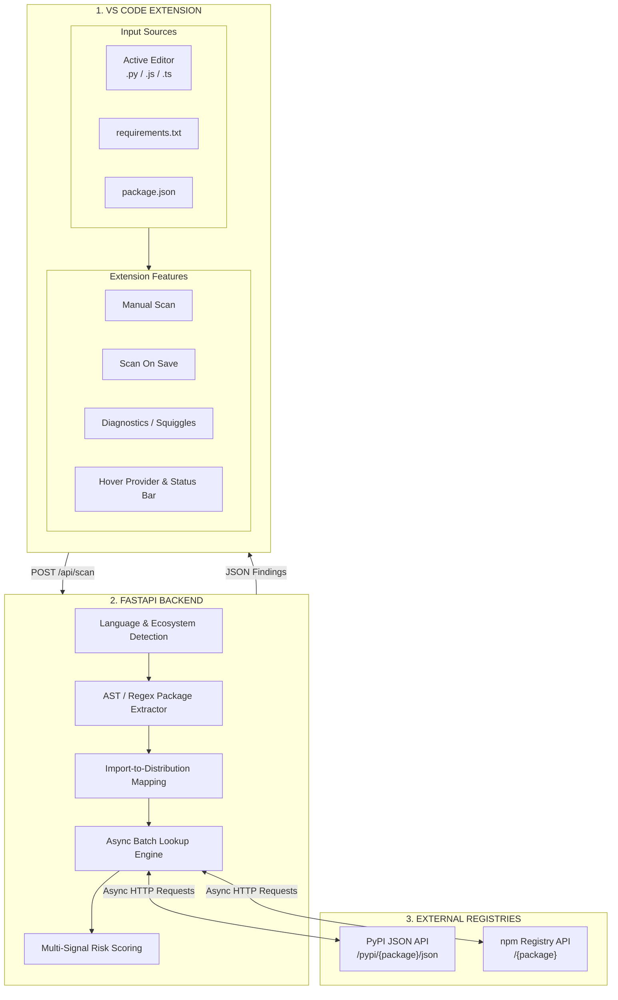
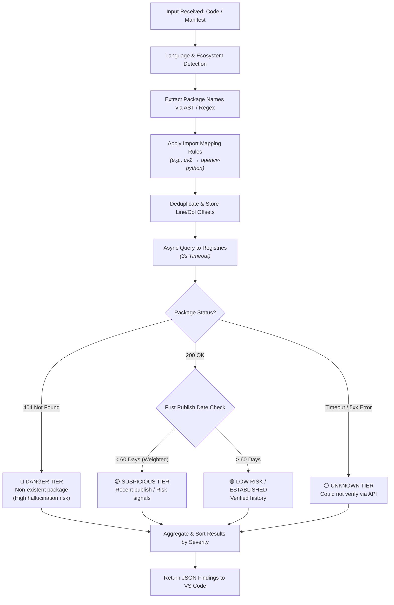

# PhantomPkg: Slopsquatting Detector

PhantomPkg is a real-time, "shift-left" security tool that detects AI-hallucinated and typosquatted dependencies directly within the IDE *before* they can be executed or installed.

---

## Problem Statement
AI coding assistants (like ChatGPT, Copilot, and Claude) frequently hallucinate dependency package names. Attackers exploit this via **Slopsquatting**: they pre-register these hallucinated names on public registries (like PyPI and npm) and upload malware. When developers copy-paste AI-generated code and run `pip install` or `npm install`, malware is installed silently. Traditional vulnerability scanners only work *after* the package is locked or installed.

## Solution
PhantomPkg bridges this gap by acting as a real-time shield. It intercepts code at the keystroke level (`onSave`), extracts imports using language-specific syntax trees, and asynchronously verifies them against public registries. Developers are visually warned of hallucinated or malicious packages directly in VS Code before executing any terminal commands.

---

## Implemented Features & Modules

### 1. Intelligent Parsing Module (Python & JS/TS)
- Uses Python's built-in **Abstract Syntax Tree (AST)** to guarantee 0% false positives from comments or strings.
- Implements an **Import-to-Package mapping layer** to resolve aliases (e.g., `import cv2` -> `opencv-python`) and prevent false flags.

### 2. Multi-Factor Risk Classification Engine
Packages are dynamically classified into 4 actionable risk tiers:
- 🔴 **Danger:** Package does not exist (HTTP 404). Prime hallucination/slopsquatting target.
- 🟠 **Suspicious:** Package exists but is < 60 days old OR has > 85% string similarity to a popular seed package.
- 🟡 **Low Risk:** Established, safe packages.
- ⚪ **Unknown:** Network timeout or offline state (graceful degradation).

### 3. Asynchronous Backend Module
- Built with **FastAPI**, `asyncio`, and `httpx` to handle batch registry lookups in parallel.
- Integrates **RapidFuzz** for millisecond-level Levenshtein distance calculations (typosquatting detection) without freezing the IDE.

### 4. VS Code UI Integration
- Non-intrusive native API integration: Uses background highlights, `DiagnosticCollection` (squiggly lines), hover tooltips, and status bar metrics to prevent alert fatigue.

---

## Tech Stack
* **Client / Frontend:** VS Code Extension API, TypeScript, Node.js
* **Backend API:** Python 3.11+, FastAPI, Uvicorn
* **Algorithms & Networking:** `RapidFuzz` (String similarity), `httpx` (Async HTTP requests), Python `ast`
* **Ecosystems Supported:** PyPI (Python), npm (JavaScript/TypeScript)

---

## System Architecture


---

## Backend Process Flow & Risk Analysis


---

## Setup Instructions

### Prerequisites
- Python 3.11+
- Node.js & npm

### Step 1: Start the Backend
Open a terminal and navigate to the backend folder:
```bash
cd backend
pip install -r requirements.txt
python main.py
```
*The API will start running at `http://127.0.0.1:8000`.*

### Step 2: Run the VS Code Extension
Open a new VS Code window and navigate to the extension folder:
```bash
cd extension
npm install
```
1. Open the `extension` folder in VS Code (`File` -> `Open Folder` -> `PhantomPkg/extension`).
2. Press **`F5`** (or go to Run -> Start Debugging).
3. Select **`npm: compile`** if prompted.
4. A new VS Code window labeled **`[Extension Development Host]`** will open.

### Step 3: Test It
In the new Extension Development Host window:
1. Create a new file and save it as `test.py`.
2. Paste some test imports (e.g., `import requests`, `import fake_ai_package_123`, `import reqeusts`).
3. Press `Ctrl+S`. You will instantly see the color-coded background highlights and hover tooltips!

---
